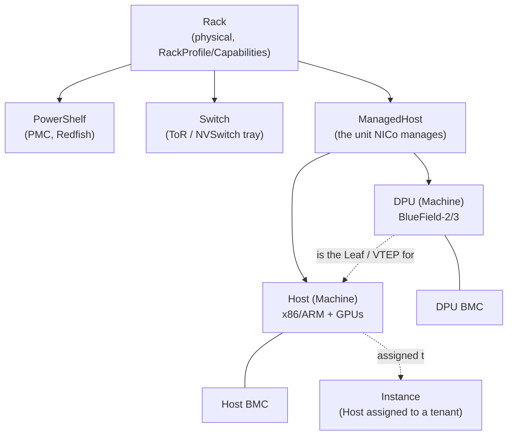
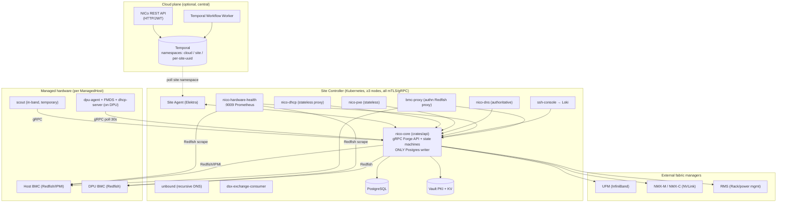
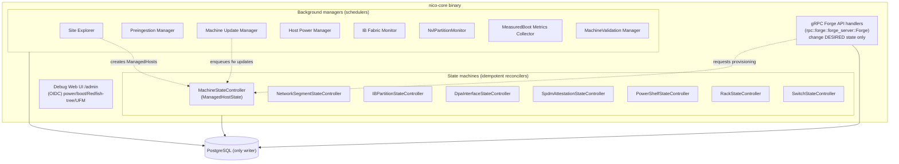
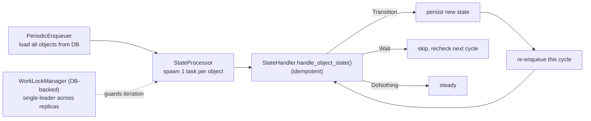
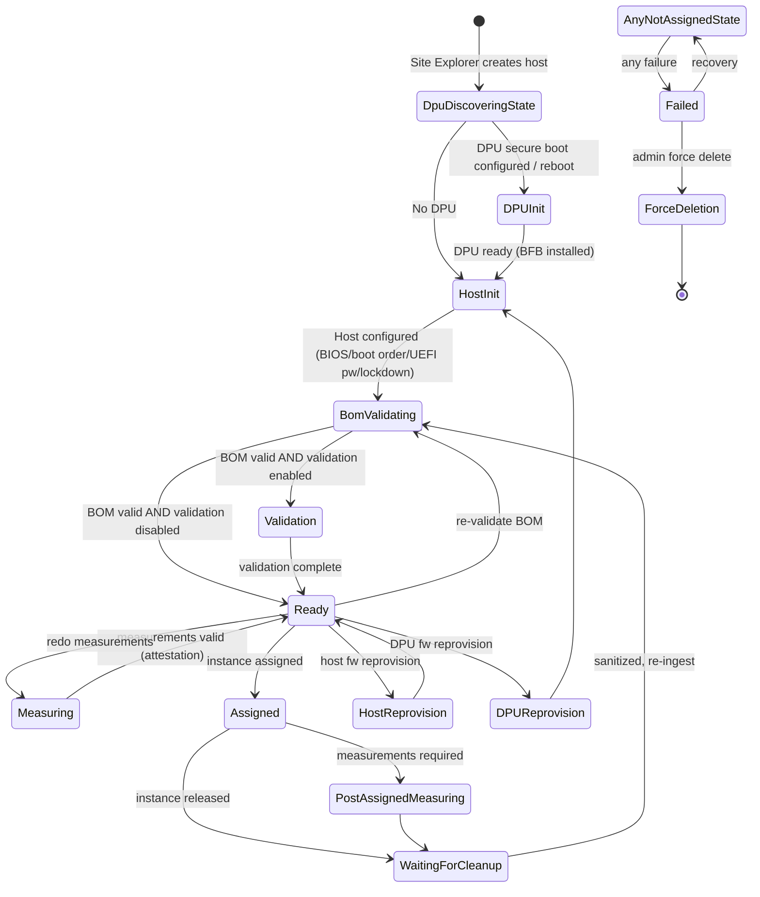
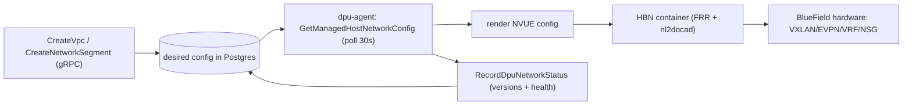
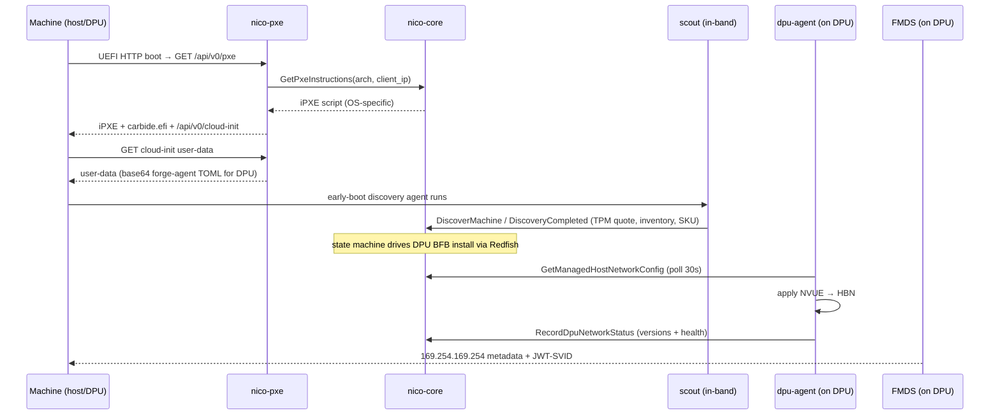
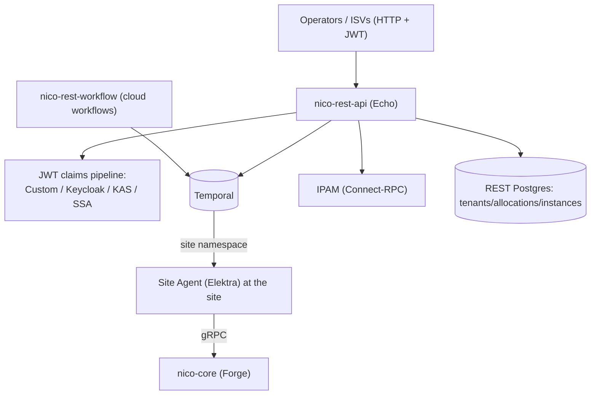

# NVIDIA Infra Controller (NICo): Complete Architecture Deep Dive

> A ground-up analysis of this repository (`NVIDIA/infra-controller`, codenames Carbide / Forge / nvmetal / NCX / BMM): every primitive, every abstraction, how they interact, and how each maps onto the underlying NVIDIA technology. Code references use `path:line`. External primitives are linked to the canonical NVIDIA / DMTF / standards-body documentation.
>
> Status of the product: experimental / preview. License: Apache-2.0.
> This document was generated by reading the source tree plus the local `docs/`, and cross-checking every NVIDIA primitive against official documentation (URLs in [Part XII](#part-xii--nvidia--standards-documentation-index)).

---

## Table of contents

- [Part 0 — One-paragraph mental model](#part-0--one-paragraph-mental-model)
- [Part I — Primitives and abstractions (the vocabulary)](#part-i--primitives-and-abstractions-the-vocabulary)
- [Part II — System topology and deployment](#part-ii--system-topology-and-deployment)
- [Part III — NICo Core internals](#part-iii--nico-core-internals)
- [Part IV — The state-machine engine](#part-iv--the-state-machine-engine)
- [Part V — The ManagedHost lifecycle](#part-v--the-managedhost-lifecycle)
- [Part VI — Networking and tenant isolation (three fabrics)](#part-vi--networking-and-tenant-isolation-three-fabrics)
- [Part VII — BMC, Redfish, firmware, attestation](#part-vii--bmc-redfish-firmware-attestation)
- [Part VIII — Boot and provisioning data plane](#part-viii--boot-and-provisioning-data-plane)
- [Part IX — The gRPC contract and data model](#part-ix--the-grpc-contract-and-data-model)
- [Part X — The REST layer (cloud plane)](#part-x--the-rest-layer-cloud-plane)
- [Part XI — Health, observability, deployment](#part-xi--health-observability-deployment)
- [Part XII — NVIDIA / standards documentation index](#part-xii--nvidia--standards-documentation-index)
- [Appendix A — Crate map](#appendix-a--crate-map)
- [Appendix B — End-to-end provisioning trace](#appendix-b--end-to-end-provisioning-trace)

---

## Part 0 — One-paragraph mental model

NICo turns a rack of bare-metal servers into a cloud-like, API-driven pool of isolated instances, **without ever trusting the host OS**. The trust boundary is the **BlueField DPU** plugged into each server: NICo owns the DPU end-to-end (OS, firmware, networking) and uses it plus the out-of-band **BMC/Redfish** path to discover, validate, attest, provision, isolate, and sanitize each host. The product is two cooperating halves:

1. **NICo Core** (Rust, `crates/`) — the site-local control plane. A single `nico-core` binary (`crates/api`) exposes one giant **gRPC `Forge` service** (~437 RPCs), owns the only PostgreSQL connection, and runs a set of **idempotent state machines** that drive real hardware via Redfish/IPMI/UFM/NMX. Stateless helper services (DHCP, PXE, DNS, hardware-health, ssh-console, bmc-proxy) surround it.
2. **NICo REST** (Go, `rest-api/`) — the cloud-facing plane. A REST/JWT API plus **Temporal** workflows orchestrate cross-site operations and tenant-facing resource pools; a per-site **Site Agent** bridges Temporal back down to Core's gRPC.

Everything below expands these two halves and grounds every NVIDIA term.

---

## Part I — Primitives and abstractions (the vocabulary)

### I.1 The hardware object graph



| Primitive | What it is | Defined / grounded |
|---|---|---|
| **ManagedHost** | The fundamental unit NICo manages: one **Host** plus its attached **DPU(s)**. The Core data model stores DPUs as a list (multi-DPU and config-gated zero-DPU supported). | `ManagedHostState` enum at `crates/api-model/src/machine/mod.rs:1076`; composite `ManagedHostStateSnapshot` at `:106`. |
| **Machine** | Generic term for *either* a Host or a DPU. APIs that do not care about the distinction (health, power, search) use `Machine`. | `struct Machine` at `crates/api-model/src/machine/mod.rs:657`. |
| **Host** | The compute server (x86, sometimes ARM/Grace) with arbitrary GPUs. Runs whatever OS the tenant provisions. Has its own BMC. | Glossary `docs/glossary.md`; capabilities page lists L40/L40S, HGX/DGX A100/H100/B200, GB200 NVL72, Grace. |
| **DPU** | NVIDIA **BlueField-2/3** data processing unit: ARM complex + ConnectX NIC + its own BMC + OS. NICo's enforcement point and the host's network **Leaf / VTEP**. | See [I.3](#i3-nvidia-hardware-primitives-grounded). |
| **Instance** | A Host currently allocated to a tenant: validated hardware + isolated networking + DHCP/DNS. Output of the provisioning pipeline. | `Instance` proto, `crates/rpc/proto/forge.proto`; `Assigned{instance_state}` state. |
| **BMC** | Baseboard Management Controller. Two per ManagedHost (host BMC + DPU BMC). Out-of-band management via **Redfish** + IPMI. Discovered via DHCP. | DMTF Redfish, [XII.10](#xii10-redfish-dmtf). |
| **SKU / BOM** | SKU = expected hardware definition; BOM = the actual bill-of-materials discovered. `BomValidating` state diffs them. | `crates/api-model/src/sku.rs`; BOM state diagram `docs/architecture/state_machines/managedhost.md`. |
| **Rack / PowerShelf / Switch** | First-class physical resources, each with its own state controller and `Expected*` manifest. PowerShelf = power distribution (PMC over Redfish); Switch = ToR or NVSwitch tray. | `crates/rack-controller`, `crates/power-shelf-controller`, `crates/switch-controller`. |
| **Expected Machines / Racks / Switches / PowerShelves** | Operator-supplied manifests of what *should* be present (BMC MAC, factory creds, serials, SKU, rack id, DPU mode). Site Explorer matches discovered hardware against them. | `ExpectedMachine` proto; `ReplaceAllExpectedMachines` RPC; tables `expected_machines` etc. |

### I.2 The software/abstraction object graph

| Primitive | Role | Where |
|---|---|---|
| **NICo Core / `nico-core`** | The control-plane binary; gRPC `Forge` API + state machines + only DB writer. | `crates/api/src/main.rs:28`, `run.rs:37`, `setup.rs`. |
| **NICo REST / `nico-rest`** | Cloud REST/JWT API + Temporal orchestration. | `rest-api/`. |
| **Site Controller** | The whole Kubernetes-hosted control plane co-located in one datacenter (Core + helpers). | `docs/overview/what-is-nico.md`. |
| **Site Agent (Elektra)** | Per-site bridge: polls a site Temporal namespace, translates tasks into gRPC to local Core, publishes inventory back. | `rest-api/site-agent`. |
| **Scout (`forge-scout`)** | Temporary in-band agent on host/DPU during discovery: collects inventory unobtainable out-of-band, runs validation tests, performs tenant-release cleanup. | `crates/scout`. |
| **DPU Agent (`forge-dpu-agent`)** | Persistent daemon on the DPU ARM OS: polls Core every ~30s for desired network config, applies it via HBN, runs health checks, hosts FMDS, self-updates, applies hotfixes. | `crates/agent`. |
| **FMDS** | NICo Metadata Service on the DPU: HTTP metadata API (EC2-style) for tenant workloads, plus SPIFFE JWT-SVID issuance. | `crates/fmds`. |
| **State machine** | Idempotent per-resource reconciler. Exists for ManagedHost, NetworkSegment, IB Partition, NVLink Logical Partition, DPA Interface, SPDM Attestation, PowerShelf, Rack, Switch. | `crates/state-controller`. |
| **Background managers** | Schedulers that select work but never own a resource lifecycle directly: Site Explorer, Preingestion Manager, Machine Update Manager, Host Power Manager, IB Fabric Monitor, NVLink Manager. | [Part III](#part-iii--nico-core-internals). |

> **Legacy naming**: `Forge`, `Carbide`, `BMM`, `nvmetal`, `Elektra` are pre-NICo internal names. They survive in binary names (`forge-*`, `carbide-*`), the gRPC service name (`Forge`), metric prefixes (`forge_*`, `carbide_*`), DB names, and Helm artifacts. NICo is the product brand.

### I.3 NVIDIA hardware primitives, grounded

| Primitive | Definition (verified) | Doc |
|---|---|---|
| **BlueField DPU** | Infrastructure compute-on-a-chip: ConnectX NIC + ARM A78 cores (16 on BF-3) + programmable **DPA (Datapath Accelerator)** + integrated DPU BMC (ASPEED AST2600, OpenBMC `bmcweb`). BF-3 = 400 Gb/s on ConnectX-7; BF-2 = 200 Gb/s on ConnectX-6 Dx. | [product](https://www.nvidia.com/en-us/networking/products/data-processing-unit/), [BF-3 datasheet](https://www.nvidia.com/content/dam/en-zz/Solutions/Data-Center/documents/datasheet-nvidia-bluefield-3-dpu.pdf) |
| **rshim** | Host/BMC-side interface (PCIe or USB) presenting `rshimN`; used to push a bootstream (BFB) to the DPU and reach its console. NICo's "preingestion BFB recovery" uses it. | [BFB from host](https://docs.nvidia.com/networking/display/BlueFieldDPUBSPv422/Deploying+BlueField+Software+Using+BFB+from+Host) |
| **DPU BMC** | Independent BMC on the DPU exposing Redfish HTTPS, with its own root-of-trust and SPDM attestation. | [DPU BMC Redfish](https://docs.nvidia.com/networking/display/bluefieldbmcv2501/platform+management+interface) |
| **DOCA** | NVIDIA's SDK + runtime for BlueField (CUDA-analog). Ships **BF-Bundle** (on-DPU OS/drivers/fw) + **DOCA-Host**. **DOCA Services** are containerized DOCA programs from NGC (HBN, BlueMan, Firefly, Argus). | [DOCA SDK](https://docs.nvidia.com/doca/sdk/index.html), [Services](https://docs.nvidia.com/doca/sdk/doca+services/index.html) |
| **BFB (BlueField Bootstream)** | NVIDIA installer image bundling ATF + UEFI + Arm rootfs + NIC firmware + initramfs. Installed via rshim with `bfb-install`/`bf.cfg`. NICo ships a customized NICo BFB (with dpu-agent/HBN/FMDS/CA) and a vanilla preingestion BFB. | [BFB from BMC](https://docs.nvidia.com/networking/display/bluefielddpuosv380/deploying+dpu+os+using+bfb+from+bmc) |
| **Spectrum switch** | NVIDIA Ethernet switch ASIC/system family (Spectrum-4 = 51.2 Tb/s, SN5000 series). Runs Cumulus Linux. Pairs with BF-3 SuperNICs in Spectrum-X. | [SN5000](https://docs.nvidia.com/networking/display/sn5000) |
| **NVSwitch / NVLink** | GPU-to-GPU fabric. NVSwitch = the switch chip forming an NVLink domain. 5th-gen NVLink (Blackwell) = 1.8 TB/s/GPU; NVL72 = 72-GPU domain. | [NVLink](https://www.nvidia.com/en-us/data-center/nvlink/), [Fabric Manager](https://docs.nvidia.com/datacenter/tesla/fabric-manager-user-guide/index.html) |

---

## Part II — System topology and deployment

NICo Core runs as Kubernetes microservices on a 3+ node cluster co-located in the datacenter (the **Site Controller**). All inter-service traffic is **mTLS/gRPC with SPIFFE identities**.



**Deployment layers** (`README.md`, `helm-prereqs/README.md`):
1. **Common services** (helmfile): MetalLB (VIPs), cert-manager (+ approver-policy), Vault (PKI+KV, 3-node Raft), External Secrets Operator, PostgreSQL (Zalando operator, Spilo-15).
2. **Carbide Core** = this repo's `helm/` umbrella chart (subcharts `nico-api`, `nico-bmc-proxy`, `nico-dhcp`, `nico-dns`, `nico-hardware-health`, `nico-pxe`, `nico-ssh-console-rs`, `nico-dsx-exchange-consumer`, `nico-flow`, `unbound`).
3. **Carbide REST** = `rest-api/` Helm charts + Temporal + Keycloak + site-agent.

Alternative legacy path: **Kustomize** under `deploy/` (`nico-base`, `nico-system`, `nico-unbound-base`, reusable `components/`). On-DPU workloads ship as Helm charts in `bluefield/charts/` (`nico-dpu-agent`, `nico-dhcp-server`, `nico-fmds`, `nico-otelcol`, `nico-dpu-otel-agent`).

**Dependency services** NICo does not build: PostgreSQL (DB `forge_system_carbide` / "forgedb"), Vault, Temporal, cert-manager, ESO, Prometheus/Grafana/OpenTelemetry/Loki, MetalLB, ArgoCD (optional), NGC Registry, Keycloak (optional OIDC).

---

## Part III — NICo Core internals

`nico-core` is "a collection of independent components deployed in one binary" (`docs/architecture/overview.md`). Startup is `main()` → `carbide::run()` → `setup::start_api()` → `initialize_and_start_controllers()`.

- `crates/api/src/main.rs:28` — CLI: `Migrate` (DB migrations) or `Run`.
- `crates/api/src/run.rs:37` — config + telemetry + credential chain (Env → File → Vault) + Redfish client pools, then spawns everything into a `JoinSet` (joined forever at `run.rs:281`).
- `crates/api/src/setup.rs:798` — `initialize_and_start_controllers()` wires the whole control plane.



The handlers never mutate real hardware state directly. They flip a **desired** flag (`provisioning required`, `reprovision_requested`, `deleted`, etc.); the state machines drive the **actual** transition. This keeps exactly one owner of a resource's lifecycle at any moment.

**Background managers (all work-locked, periodic):**
- **Site Explorer** (`crates/site-explorer/src/lib.rs:263`) — Redfish crawler over the underlay; collects serials/inventory/power/boot-order/firmware/lockdown; **pairs hosts↔DPUs by shared DPU serial**; creates `Machine` records and kickstarts ingestion. Needs the Expected Machines manifest. Metrics `carbide_endpoint_exploration_*`, `carbide_site_explorer_*`.
- **Preingestion Manager** (`crates/preingestion-manager/src/lib.rs:74`) — for hosts below the minimum ingestable firmware version (their BMC cannot yet map host↔DPU). Drives firmware upload/reset and **BFB recovery/copy via rshim** before normal ingestion.
- **Machine Update Manager** (`crates/api/src/machine_update_manager/mod.rs:58`) — *selects* `Ready`, healthy hosts for firmware updates respecting a health SLA (never all at once); the actual update runs inside the ManagedHost state machine. Modules: `HostFirmwareUpdate`, `DpuNicFirmwareUpdate`. Optional.
- **IB Fabric Monitor** (`crates/ib-fabric/src/lib.rs:58`) — all UFM interaction (see [VI.2](#vi2-infiniband--ufm)). Metrics `forge_ib_monitor_*`.
- **NvlPartitionMonitor** (`crates/nvlink-manager/src/lib.rs:95`) — reconciles NVLink logical partitions against NMX (see [VI.3](#vi3-nvlink--nmx)).

---

## Part IV — The state-machine engine

The engine is generic over a resource via the `StateHandler` trait (`crates/state-controller/src/state_handler.rs:58`):

```rust
trait StateHandler {
    type ObjectId; type State; type ControllerState; type ContextObjects;
    async fn handle_object_state(&self, id, state: &mut State,
        controller_state, ctx) -> Result<StateHandlerOutcome<ControllerState>, StateHandlerError>;
}
```

Each invocation returns one outcome (`state_handler.rs:153`):
- **`Transition{next_state}`** — advance + persist + re-enqueue immediately.
- **`Wait{reason}`** — dependency not ready; re-check next full cycle.
- **`DoNothing`** — steady state (e.g. `Ready`, `Assigned`).
- **`Deleted`** — gone; clean up.

Outcomes can carry a `PgTransaction` so the state change and its side-effect writes commit atomically. Every outcome records `#[track_caller]` source location for debugging, surfaced in the Debug UI as `controller_state_outcome`.



Key structures: `StateController<IO>` (`controller.rs:95`), `StateProcessor` (`controller/processor.rs:45`), built via a fluent builder and `build_and_spawn(join_set, cancel_token)`. Concurrency safety across API replicas comes from a **DB-backed work lock** (`work_locks` table). Shared services injected into every handler (`common_services.rs:34`): `db_pool`, `redfish_client_pool`, `ib_fabric_manager`, `ipmi_tool`, `credential_manager`, `rms_client`, `site_config`, optional `dpa_info`.

State transitions can be broadcast to external buses via the **State Change Emitter** (e.g. an MQTT hook publishing to the DSX Exchange).

`machine-a-tron` (`crates/machine-a-tron`) is a full simulation harness (mock BMCs, mock SSH, TUI) for exercising the state machine without hardware.

---

## Part V — The ManagedHost lifecycle

This is the heart of the product: `ManagedHostState` (`crates/api-model/src/machine/mod.rs:1076`) with deeply nested sub-states. Canonical happy path:

```
Created → DpuDiscoveringState → DPUInit → HostInit → BomValidating
        → Validation → Measuring → Ready → Assigned
        → (PostAssignedMeasuring) → WaitingForCleanup → Ready ...
```



The full sub-state diagrams (DPU discovery secure-boot dance, BFB install, host UEFI password/lockdown, BOM SKU matching, attestation measuring, host/DPU reprovision firmware flows, NVMe/BOSS secure-erase cleanup, instance network provisioning) live in `docs/architecture/state_machines/managedhost.md`. The notable phases:

- **DpuDiscoveringState** — enable rshim, decide BFB-install support, run an **EnableSecureBoot / DisableSecureBoot** sub-machine on the DPU BMC (check → set → reboot ×2 → recheck, 5-min waits, 10-retry cap), set UEFI HTTP boot, reboot all DPUs.
- **DPUInit** — install DPU OS via **BFB** (`InstallingBFB → WaitForInstallComplete → Completed`), power-cycle host, wait for DPU network, enable IPMI-over-LAN.
- **HostInit** — set boot order (DPU-first), UEFI password setup, **lockdown**, then attestation (Measuring) or discovery.
- **BomValidating** — match discovered inventory to the assigned **SKU**; diff drives `SkuVerificationFailed` / `WaitingForSkuAssignment` / `SkuMissing`.
- **Measuring / PreAssignedMeasuring / PostAssignedMeasuring** — TPM measured-boot + SPDM attestation against golden bundles.
- **Assigned → WaitingForCleanup** — on release: **secure-erase BOSS/NVMe**, host cleanup (via scout), recreate boot volume, re-ingest. This is the tenant-sanitization guarantee.
- **HostReprovision / DPUReprovision** — firmware upgrade flows (upload → upgrade → reset → verify), with `InitialReset`/`WaitBoot` pre-update resets.

Per-host knobs at build time (`setup.rs:1088`): `attestation_enabled`, `bom_validation`, `machine_validation_config`, `dpu_up_threshold`, `failure_retry_time`, `scout_reporting_timeout`, `dpf_sdk`.

---

## Part VI — Networking and tenant isolation (three fabrics)

NICo coordinates tenant isolation across three independent fabrics, each with its own enforcement point and external manager. The operational principle: **the underlay fabric stays static during tenancy changes** — isolation happens at the DPU and via fabric-manager APIs, never by re-cabling or reconfiguring leaf switches.

| Fabric | Isolation mechanism | Enforcer | NICo subsystem |
|---|---|---|---|
| Ethernet (north-south) | VXLAN + EVPN, VRFs, Network Security Groups | DPU via **HBN** | FNN + dpu-agent + nvue-client |
| InfiniBand (east-west) | Partition keys (**P_Key**) | **UFM** | ib-fabric + ib-partition-controller |
| NVLink | NVLink partitions | **NMX-M / NMX-C** | nvlink-manager (libnmxc/libnmxm) |
| Spectrum-X (east-west) | SP-X partitioning | Spectrum-X | (capability-level) |

### VI.1 Ethernet — HBN / FNN / NVUE

**HBN (Host-Based Networking)** is a DOCA Service container running on the DPU's ARM cores. It pushes L3 routing to the server edge using **FRR** (BGP/EVPN control plane) and **NVUE** (declarative config model), with **`nl2docad`** mirroring kernel routing/bridging into BlueField hardware. NICo installs and manages HBN; it never touches the Spectrum switches (which run Cumulus Linux + FRR independently).

- HBN container management: `crates/agent/src/hbn.rs:67` (`doca-hbn` container, `nv config apply`, 45s timeout).
- NVUE client (REST + startup-file modes): `crates/nvue-client/`, applied from `crates/agent/src/ethernet_virtualization.rs` and `crates/agent/src/nvue.rs`.

**FNN (Fabric Nearest Neighbor)** is Core's VPC/subnet/overlay subsystem (`crates/network/src/virtualization.rs:27`). The `VpcVirtualizationType` enum: `Fnn` (production), `EthernetVirtualizer` (legacy ETV), `Flat` (zero-DPU). FNN supports `fnn_classic` and `fnn_l3`, plus per-VPC **routing profiles** (`internal`, `access_tier`, route-target import/export, underlay leak policy) defined in site config.

Config generation (in dpu-agent, `crates/agent/src/nvue.rs`):
- **L2 VNI** per overlay network segment; SVI MAC derived from VNI via `vni_to_svi_mac()`.
- **L3 VNI** per VPC; per-VPC VRF named `vpc_{l3_vni}`; EVPN route targets `{asn, vni}`.
- Inter-VPC peering via `vpc_peer_vnis` / `site_global_vpc_vni` (BGP route-target community membership).
- **Network Security Groups** compiled to iptables (priority base 2000, max 10000 rules/NSG).

**Network Segments** (`crates/api-model/src/network_segment/mod.rs:182`): types `Tenant` (overlay), `Admin`, `Underlay`, `HostInband`. Allocation `Dynamic` (DHCP pool) vs `Reserved` (static only). The **NetworkSegmentStateController** (`crates/network-segment-controller/src/handler.rs`) runs `Provisioning → Ready → Deleting{DrainAllocatedIps → DBDelete}` with a drain period. VLAN-id / VNI / prefix pools come from `ResourcePool<T>`.


Grounding: [DOCA HBN](https://docs.nvidia.com/doca/sdk/nvidia-doca-hbn-service-guide.pdf), [NVUE object model](https://docs.nvidia.com/networking-ethernet-software/cumulus-linux-55/System-Configuration/NVIDIA-User-Experience-NVUE/NVUE-Object-Model/), [FRR EVPN](https://docs.frrouting.org/en/latest/evpn.html).

### VI.2 InfiniBand — UFM

**UFM (Unified Fabric Manager)** manages the InfiniBand fabric; tenant isolation uses **partitions** keyed by **P_Key** (16-bit, top bit = membership type, range `0x0`–`0x7fff`; `0x7fff` = default). Hosts join a partition by adding their port **GUID** with full or limited membership.

- **IB Fabric Monitor** (`crates/ib-fabric/src/lib.rs:58`): checks UFM health, verifies multi-tenant security config, fetches applied partitioning per host port (stored in `Machine::ib_status`), and binds GUIDs↔P_Keys to match desired config.
- UFM REST client: `crates/ib-fabric/src/ib/ufmclient/mod.rs` — `Partition{name, pkey, ipoib, qos, guids, membership}`, QoS `{mtu_limit, service_level 0-15, rate_limit}`, `PartitionKey` type with `0x{hex}` display.
- **IBPartitionStateController** (`crates/ib-partition-controller/src/handler.rs`): `Provisioning → Ready → Deleting`; P_Key allocated from `pkey_pools`.

Grounding: [UFM PKey REST API](https://docs.nvidia.com/networking/display/ufmenterpriserestapiv6222/pkey+guids+rest+api) (`/ufmRest/resources/pkeys`), [IB partitioning/security](https://docs.nvidia.com/networking/display/NVIDIAInfiniBandSecurityOverviewandGuidelines/Security+in+InfiniBand).

### VI.3 NVLink — NMX

**NMX (NVLink Management Software)** is the NVLink-fabric analog of UFM for rack-scale systems (GB200/GB300 NVL72) using **MNNVL (Multi-Node NVLink)**. Partitions subdivide the NVLink domain (Default Partition id 32766 holds all healthy GPUs; User Partitions isolate tenants). Components: **NMX-C** (controller, partition CRUD via gRPC), **NMX-T** (telemetry), **NetQ NVLink** (the current name for legacy "NMX-M", REST monitoring).

- **NvlPartitionMonitor** (`crates/nvlink-manager/src/lib.rs:95`): loads MNNVL-capable machines + NVLink partition records, queries NMX for GPU/partition state, records `MachineNvLinkStatusObservation`, and creates/updates/removes NMX partitions (incl. `RemoveUnknownPartition`).
- Clients: `crates/libnmxc` (NMX-C gRPC, gateway id `"carbide"`), `crates/libnmxm` (NMX-M/NetQ REST, cookie auth).

Grounding: [NVLink Partition Management](https://docs.nvidia.com/mission-control/docs/systems-administration-guide/2.2.0/nvlink-partition-management.html), [MNNVL](https://docs.nvidia.com/multi-node-nvlink-systems/mnnvl-user-guide/overview.html), [Fabric Manager](https://docs.nvidia.com/datacenter/tesla/fabric-manager-user-guide/index.html).

> **Accuracy note**: NVIDIA's current docs call the former "NMX-M" **NetQ NVLink**. NICo source and docs still use `NMX-M`/`libnmxm`.

### VI.4 DPA interface, switches, racks
- **DpaInterfaceStateController** (`crates/dpa-interface-controller/src/handler.rs`): unlock → apply firmware → apply profile → relock, driven over MQTT, for DPA cards.
- **SwitchStateController** (`crates/switch-controller`) and **RackStateController** (`crates/rack-controller`): lifecycle for ToR/NVSwitch trays and racks; rack resolves a `RackProfile`/`RackCapabilitiesSet`.
- **DPF** (`crates/dpf`): SDK wrapper over the **DOCA Platform Framework** Kubernetes CRDs (`BFB`, `DPUFlavor`, `DPUDeployment`, `DPUService`, `DPUSet`, service chains/NADs). Used when DPF-managed DPU provisioning is enabled. Grounding: [DPF](https://docs.nvidia.com/networking/display/dpf2507/component+description), [github.com/NVIDIA/doca-platform](https://github.com/NVIDIA/doca-platform/).

---

## Part VII — BMC, Redfish, firmware, attestation

### VII.1 Redfish client and vendor abstraction
`crates/redfish` wraps two libraries (`libredfish`, `nv-redfish`) behind `RedfishClientPool` (`src/lib.rs:54`). Auth modes: Anonymous / Direct (factory creds from Expected Machines) / Key (by BMC MAC after rotation). Vendor handling in `crates/bmc-vendor` (`BMCVendor`: Dell, Supermicro, HPE, Nvidia DPU/Viking/Oberon, Lenovo, LenovoAMI, Liteon), detected from the `/redfish/v1` service root.

The Redfish workflow (`docs/architecture/redfish_workflow.md`): DHCP discovery → anonymous vendor probe → authenticated `EndpointExplorationReport` (system/chassis serials, NetworkAdapters, PCIeDevices, Managers, FirmwareInventory, BootOptions, PowerState) → **host↔DPU pairing by serial** (PCIe `is_bluefield()` primary, network-adapter fallback, `fallback_dpu_serial_numbers` last) → DPU provisioning (HTTP UEFI boot + `ComputerSystem.Reset`) → host BIOS/boot config → ongoing ~60s sensor + firmware polling.

Grounding: [Redfish DSP0266](https://www.dmtf.org/sites/default/files/standards/documents/DSP0266_1.22.0.html), [schema index](https://redfish.dmtf.org/redfish/schema_index).

### VII.2 BMC proxy and IPMI
- **bmc-proxy** (`crates/bmc-proxy`): an mTLS-authenticated HTTP/2 proxy that decouples BMC credential handling. Client sends `Forwarded: host=<bmc_ip>`; proxy resolves identity via `FindMacAddressByBmcIp` + `GetBmcCredentials` from Core, enforces a per-SPIFFE-principal casbin ACL, then forwards to the BMC. Credential cache refreshes every 5 min.
- **ipmi** (`crates/ipmi`): `IPMITool` trait. Real impl shells `ipmitool -I lanplus -C 17` for `bmc reset cold`, `chassis power reset`, DPU legacy boot (`raw 0x32 0xA1 0x01`); HTTP mock impl for machine-a-tron. IPMI-over-LAN enabled during HostInit; serial-over-LAN feeds ssh-console.

Grounding: [IPMI 2.0 spec](https://www.intel.la/content/dam/www/public/us/en/documents/specification-updates/ipmi-intelligent-platform-mgt-interface-spec-2nd-gen-v2-0-spec-update.pdf).

### VII.3 Firmware
`crates/firmware`: `FirmwareConfig` keyed by vendor+model with TOML overrides; `FirmwareConfigSnapshot.find(vendor, model)`. Background `downloader.rs` deduplicates downloads, verifies MD5, atomic-renames. DPU firmware component IDs `DPU_NIC`/`DPU_UEFI`; versions normalized (trim, lowercase, strip `bf-`). Updates are *applied* inside the ManagedHost reprovision sub-states, *scheduled* by Machine Update Manager.

### VII.4 Attestation, measured boot, lockdown
- **measured-boot** (`crates/measured-boot`): `PcrSet`, `PcrRegisterValue`, `MeasurementReport`, bundles/journal/profiles. TPM PCRs are compared against golden "measurement bundles".
- **spdm-controller** (`crates/spdm-controller`): per-device attestation FSM `FetchMetadata → FetchCertificate → GenerateEvidence → VerifyMeasurements → Passed/Failed`, using Redfish `ComponentIntegrity` endpoints and the **NRAS** verifier. Grounding: [SPDM DSP2058](https://www.dmtf.org/sites/default/files/standards/documents/DSP2058_1.3.0.pdf), [TPM measured boot](https://tpm2-software.github.io/2020/06/12/Remote-Attestation-With-tpm2-tools.html).
- **NRAS** (`crates/nras`): NVIDIA Remote Attestation Service client for GPU attestation.
- **SuperNIC lockdown** (`docs/architecture/supernic_lockdown_key_management.md`): for non-ASTRA cards NICo derives a 64-bit per-device lock key via HKDF-SHA256 from a Vault-stored `SiteWideRoot` + `info = "supernic-lock:v1:{mac}:{machine_id}"`. Deterministic, per-device, non-reversible; never persisted; re-derivable after DR. scout unlocks/relocks during maintenance; NICo verifies the card is locked before tenant release.

### VII.5 Power and serial console
- **power-shelf-controller** (`crates/power-shelf-controller`): FSM `Initializing → FetchingData → Configuring → Ready ↔ Maintenance(PowerOn/PowerOff) → Deleting`, calling **RMS** (Rack Manager Service) over gRPC; `SetPowerShelfMaintenance` RPC sets the desired flag atomically across shelves.
- **ssh-console** (`crates/ssh-console`): continuously connects to every host BMC over SSH/IPMI, logs serial console to disk + Loki, and serves authenticated live console over SSH (russh, default `:2222`). **log-parser** (`crates/log-parser`) tails these logs and raises health alerts from regex/sequence/frequency rules.

---

## Part VIII — Boot and provisioning data plane



- **PXE** (`crates/pxe`, `forge-pxe`): Axum service. Routes `/api/v0/pxe` (iPXE script), `/api/v0/cloud-init`, `/api/v0/tls`, `/public` (carbide.efi/root blobs), `/metrics`. Stateless; calls `GetPxeInstructions`. `crates/ipxe-renderer` does template validation + artifact caching + SHA256 tamper checks. Two BFBs: NICo BFB (customized) and preingestion BFB (vanilla, via rshim).
- **scout** (`crates/scout`, `forge-scout`): discovery (Redfish inventory + DPU↔host pairing), SMBIOS/SKU collection, TPM attestation quotes, machine-validation execution, and tenant-release cleanup (disk scrub). Streams gRPC to Core; callbacks `DiscoveryCompleted`, `RebootCompleted`, `MachineValidationCompleted`.
- **dpu-agent** (`crates/agent`, `forge-dpu-agent`): 30s `GetManagedHostNetworkConfig` poll into an `ArcSwap`; applies NVUE→HBN; health probes (BGP peering, services, disk, DHCP, NVUE applied); `RecordDpuNetworkStatus`; self-upgrade via `ip vrf exec mgmt apt-get`; hosts FMDS + dhcp-server; runs the remediation executor (`crates/dpu-remediation`, sandboxed bash, 120s timeout).
- **FMDS** (`crates/fmds`, `carbide-fmds`): EC2-style metadata at `169.254.169.254` (`/latest/meta-data/...`: hostname, machine-id, instance-id, infiniband, phone_home), plus `machine-identity` issuing **SPIFFE JWT-SVID** (via `SignMachineIdentity` to Core, rate-limited). Grounding: [JWT-SVID](https://spiffe.io/docs/latest/spiffe-specs/jwt-svid/).
- **DHCP**: `crates/dhcp` (`carbide-dhcp`) is a stateless Kea-hook proxy converting DHCP→gRPC `DiscoverDhcp`; `crates/dhcp-server` (`forge-dhcp-server`) runs on the DPU so host DHCP never reaches the underlay.
- **DNS**: `crates/dns` (`carbide-dns`) authoritative for delegated zones (trust-dns-server); `unbound` provides recursion.

---

## Part IX — The gRPC contract and data model

### IX.1 The `Forge` service
`crates/rpc/proto/forge.proto` (~8,256 lines) defines service **`Forge`** with ~437 RPCs, imports `common/dns/health/machine_discovery/site_explorer/mlx_device/measured_boot` protos. Domains:

- **Machine lifecycle**: `DiscoverMachine`, `DiscoveryCompleted`, `CleanupMachineCompleted`, `RebootCompleted`, `MachineValidationCompleted`, `FindMachineIds`, `FindMachinesByIds`, `TriggerMachineAttestation`.
- **Instances**: `AllocateInstance(s)`, `ReleaseInstance`, `FindInstance*`, `UpdateInstanceConfig`, `UpdateInstanceOperatingSystem`, `InvokeInstancePower`.
- **VPC/network**: `CreateVpc`, `UpdateVpcVirtualization`, `CreateVpcPrefix`, `CreateVpcPeering`, `CreateNetworkSegment`, `CreateNetworkSecurityGroup`.
- **InfiniBand / NVLink**: `CreateIBPartition`, `IBPartitionsForTenant`, `CreateNVLinkLogicalPartition`, `CreateNvlinkNmxcEndpoint`.
- **DPU/host config**: `GetManagedHostNetworkConfig`, `RecordDpuNetworkStatus`, `DpuAgentUpgradeCheck`, `CopyBfbToDpuRshim`, `SetPrimaryDpu`.
- **Boot**: `GetPxeInstructions`, `GetCloudInitInstructions`, `Get/ListIpxeTemplate`, `EnableInfiniteBoot`.
- **DHCP/IPAM**: `DiscoverDhcp`, `AssignStaticAddress`, `FindInterfaceAddresses`, `FindMacAddressByBmcIp`.
- **BMC/firmware**: `GetBmcCredentials`, `AdminBmcReset`, `Set/ClearHostUefiPassword`, `UpdateComponentFirmware`, `Lockdown`, `RedfishBrowse`/`RedfishApplyAction`.
- **Attestation/measured boot**: ~40 `Measurement*` RPCs, `SignMachineIdentity`, `AttestQuote`, `TpmAddCaCert`.
- **Health**: `Insert/Remove/List{Machine,Rack,Switch,PowerShelf}HealthReport`, `*HealthHistories`.
- **Site explorer**: `Explore`, `ReExploreEndpoint`, `FindExploredEndpoints*`, `IsBmcInManagedHost`.
- **Expected resources / SKU / instance types / racks / switches / power shelves / tenants / domains / remediation / route servers / MLX admin / NMXC browse / UFM browse**.

The Site Agent talks to Core over standard gRPC; the **IPAM** service internally uses **Connect-RPC**.

### IX.2 Data model and DB
`crates/api-model` mirrors proto messages as validated Rust domain types (modules: machine, instance, vpc, network_segment, ib_partition, nvl_partition, sku, rack, power_shelf, switch, tenant, attestation, expected_*, resource_pool, ...). The only datastore is PostgreSQL via SQLx; **334 migrations** in `crates/api-db/migrations/` (initial `20211119192131_initial.sql`). Table families: machines + state-history + interfaces + addresses; instances + subnets; vpcs + prefixes + peerings + NSGs + leafs; network_segments + prefixes; ib/nvlink partitions + endpoints; racks/switches/power_shelves + their `*_controller_lock` + `*_iteration_ids` + `expected_*`; measurement_* (attestation); spdm_*; dhcp_entries; domains; tenants/tenant_keysets; dpu_remediations; operating_systems/os_images; `work_locks`; `mq_msgs`/`mq_payloads`.

### IX.3 Service-to-service auth
mTLS with **SPIFFE** identities (`crates/authn`): X.509 leaf certs carry a SPIFFE ID in the SAN URI; `SpiffeContext{trust_domain, service_base_paths, machine_base_path}` classifies callers as `Service(...)` or `Machine(...)`. Tonic middleware (`CertDescriptionMiddleware`) extracts identity per request. `crates/kms-provider` does envelope encryption (Integrated / Vault Transit / Multi backends); `crates/certs`/`crates/tls`/`crates/secrets` manage PKI material (dual roots: Forge API + RMS).

---

## Part X — The REST layer (cloud plane)

`rest-api/` (Go, Echo + Temporal + Bun/pgx) is the cloud-facing plane. It can run central (one REST for many sites) or co-located.



- **Binaries**: `nico-rest-api` (`api/cmd/api`), `nico-rest-workflow` (`workflow/cmd/workflow`), `site-manager` (`site-manager/cmd/sitemgr`), **site-agent** (`site-agent/cmd/site-agent`), `cert-manager`/credsmgr, db migrations. Plus `nvswitch-manager` (GB200 NVLink switch trays), `powershelf-manager` (PMC), and `flow` (RLA / Rack Level Agent, formerly "rackLevelAdministration").
- **Temporal**: cloud workflows (`workflow/pkg/workflow/{site,instance,machine,vpc,sku,expectedmachine}`) on the `cloud` queue; site workflows (`site-workflow/pkg/workflow/*`) on the `site` queue with a **per-site namespace** (created by `MonitorSiteTemporalNamespaces`). Site Agent polls its namespace and bridges to Core gRPC, publishing inventory back (`workflow-schema/site-agent/workflows/v1/*.proto`).
- **Auth** (`auth/pkg/processors`): pluggable JWT processors — Custom (JWKS), Keycloak, **KAS** (NGC, legacy), **SSA** (service accounts). Role families `PROVIDER_ADMIN` / `TENANT_ADMIN` (+ viewers). Claim-mapping types A–D (static/dynamic org × static/dynamic roles).
- **Allocation/constraint model** (`db/pkg/db/model`): `Tenant` → `Allocation` (provider→tenant resource grant; statuses Pending/Registered/Error/Deleting) → `AllocationConstraint` (`ResourceType ∈ {InstanceType, IPBlock}`, `ConstraintType ∈ {Reserved, OnDemand, Preemptible}`, quota). `Instance` runs on a machine within a VPC. Pool hierarchy: site IP blocks → IPBlock constraints → tenant IP blocks → subnets/VPC prefixes; instance types (by SKU) → InstanceType constraints.
- **OpenAPI**: canonical contract at `rest-api/openapi/spec.yaml`; endpoints `/v2/org/{org}/nico/{resource}[/{id}]`; generates the Go SDK + rendered docs (Fern). Two CLIs: `nico-admin-cli` (direct gRPC) and `nicocli` (REST).

> **Accuracy note**: "NGC KAS / Key Authentication Service" could not be verified in public NVIDIA docs; the verified NGC concept is API-key auth scoped to an **NGC org** (personal keys, service keys, SAK). Treat KAS as an internal term. See [XII.13](#xii13-ngc).

---

## Part XI — Health, observability, deployment

### XI.1 Health pipeline
**nico-hardware-health** (`crates/health`, `forge-hw-health`) scrapes all host/DPU BMCs via Redfish for sensors (temperature, fans, power, leak detection), firmware inventory, and event logs (SSE + periodic). It exports Prometheus on **:9009** (`carbide_hardware_health_*`) and calls `RecordHardwareHealthReport`/`InsertMachineHealthReport` on Core. Collectors: `sensors`, `firmware`, `leak_detector`, `nmxt` (switch telemetry), `logs/{sse,periodic}`, `nvue`.

Health is reported as `HealthReport{source, alerts:[HealthProbeAlert{id, target, classifications, ...}], successes}` (`crates/rpc/proto/health.proto`). Probe IDs (`docs/architecture/health/health_probe_ids.md`): `BmcSensor`, `BgpPeeringTor`, `DhcpRelay`, `HeartbeatTimeout`, `StaleAgentVersion`, `SerialNumberMismatch`, `OrphanManagedHost`, `DpuDiskUtilizationCritical`, etc. **Alert classifications** gate behavior:
- `PreventAllocations` — host cannot be assigned to a tenant.
- `PreventHostStateChanges` — freeze state transitions.
- `SuppressExternalAlerting`, `ExcludeFromStateMachineSla`, `StopRebootForAutomaticRecovery...`.

Core merges all sources into an **aggregated host health**, used both as a metric and as a gate in the state machine and Machine Update Manager. Admins override via `InsertHealthReportOverride` (merge or replace). `crates/log-parser` and `crates/rvs` (Rack Validation Service) and `crates/nras` feed additional signals.

### XI.2 Observability
OpenTelemetry + `tracing` with structured **logfmt** logging; metric prefixes `carbide_*` / `forge_*`; helper crates `spancounter`, `prometheus-text-parser`, `metrics-endpoint`, `metrics-utils`. DPU side ships `dpu-otel-agent` + an OTel collector (`bluefield/otel/`), node_exporter, transceiver_exporter.

### XI.3 CI
`.github/workflows/`: `ci.yaml` (Rust build/test/clippy), `docker-build.yml`, `build-boot-artifacts.yml`, `release.yaml`/`promotion.yaml`, the `rest-*` set (REST CI/build/helm), and the Fern docs pipeline.

---

## Part XII — NVIDIA / standards documentation index

Every URL below was fetched and verified. NVIDIA-proprietary primitives vs open standards are marked.

### XII.1 BlueField DPU `[NVIDIA]`
- Product: https://www.nvidia.com/en-us/networking/products/data-processing-unit/
- BF-3 datasheet: https://www.nvidia.com/content/dam/en-zz/Solutions/Data-Center/documents/datasheet-nvidia-bluefield-3-dpu.pdf
- DPU BMC platform management / Redfish: https://docs.nvidia.com/networking/display/bluefieldbmcv2501/platform+management+interface
- DPU BMC SPDM attestation: https://docs.nvidia.com/networking/display/bluefieldbmcv2601/DPU-BMC-SPDM-Attestation-via-Redfish

### XII.2 DOCA `[NVIDIA]`
- SDK: https://docs.nvidia.com/doca/sdk/index.html · Overview: https://docs.nvidia.com/doca/sdk/doca-overview/index.html · Services: https://docs.nvidia.com/doca/sdk/doca+services/index.html · Dev hub: https://developer.nvidia.com/networking/doca

### XII.3 DOCA HBN `[NVIDIA service; FRR/EVPN/VXLAN std]`
- Guide (3.0.0): https://docs.nvidia.com/doca/archive/3-0-0/doca+hbn+service+guide/index.html · PDF: https://docs.nvidia.com/doca/sdk/nvidia-doca-hbn-service-guide.pdf

### XII.4 DPF — DOCA Platform Framework `[NVIDIA]`
- Repo: https://github.com/NVIDIA/doca-platform/ · CRD list (25.07): https://docs.nvidia.com/networking/display/dpf2507/component+description

### XII.5 BFB / rshim `[NVIDIA]`
- BFB from host (`bfb-install`): https://docs.nvidia.com/networking/display/BlueFieldDPUBSPv422/Deploying+BlueField+Software+Using+BFB+from+Host
- BFB from BMC: https://docs.nvidia.com/networking/display/bluefielddpuosv380/deploying+dpu+os+using+bfb+from+bmc

### XII.6 Cumulus Linux `[NVIDIA NOS]`
- User guide (5.16): https://docs.nvidia.com/networking-ethernet-software/cumulus-linux/ · Product: https://www.nvidia.com/en-us/networking/ethernet-switching/cumulus-linux/

### XII.7 NVUE `[NVIDIA]`
- Object model: https://docs.nvidia.com/networking-ethernet-software/cumulus-linux-55/System-Configuration/NVIDIA-User-Experience-NVUE/NVUE-Object-Model/
- API: https://docs.nvidia.com/networking-ethernet-software/cumulus-linux-511/System-Configuration/NVIDIA-User-Experience-NVUE/NVUE-API/

### XII.8 FRR `[open source]`
- Docs: https://docs.frrouting.org/en/latest/index.html · BGP: https://docs.frrouting.org/en/latest/bgp.html · EVPN: https://docs.frrouting.org/en/latest/evpn.html

### XII.9 Spectrum switches `[NVIDIA]`
- Ethernet switching: https://www.nvidia.com/en-us/networking/ethernet-switching/ · SN5000 manual: https://docs.nvidia.com/networking/display/sn5000

### XII.10 Redfish `[DMTF]`
- DSP0266 (1.22.0): https://www.dmtf.org/sites/default/files/standards/documents/DSP0266_1.22.0.html
- DSP0268 data model: https://www.dmtf.org/sites/default/files/standards/documents/DSP0268_2023.1.html
- Schema index: https://redfish.dmtf.org/redfish/schema_index

### XII.11 UFM + InfiniBand partitioning `[NVIDIA + IBTA]`
- UFM overview: https://docs.nvidia.com/networking/display/UFMEnterpriseUMv6170/UFM+Overview
- PKey GUIDs REST API: https://docs.nvidia.com/networking/display/ufmenterpriserestapiv6222/pkey+guids+rest+api
- IB security/partitioning: https://docs.nvidia.com/networking/display/NVIDIAInfiniBandSecurityOverviewandGuidelines/Security+in+InfiniBand
- OpenSM: https://docs.nvidia.com/networking/display/MLNXOFEDv461000/OpenSM

### XII.12 NVLink / NVSwitch / NMX / MNNVL `[NVIDIA]`
- NVLink: https://www.nvidia.com/en-us/data-center/nvlink/ · Fabric Manager: https://docs.nvidia.com/datacenter/tesla/fabric-manager-user-guide/index.html
- NVLink Management (NMX): https://docs.nvidia.com/mission-control/docs/systems-administration-guide/2.1.0/nvlink-management-software.html
- NVLink Partition Management: https://docs.nvidia.com/mission-control/docs/systems-administration-guide/2.2.0/nvlink-partition-management.html
- MNNVL: https://docs.nvidia.com/multi-node-nvlink-systems/mnnvl-user-guide/overview.html · IMEX: https://docs.nvidia.com/multi-node-nvlink-systems/imex-guide/overview.html

### XII.13 NGC `[NVIDIA]`
- User guide (API keys, org roles): https://docs.nvidia.com/ngc/latest/ngc-user-guide.html

### XII.14 Open standards
- IPMI 2.0: https://www.intel.la/content/dam/www/public/us/en/documents/specification-updates/ipmi-intelligent-platform-mgt-interface-spec-2nd-gen-v2-0-spec-update.pdf
- SPDM (DMTF): https://www.dmtf.org/standards/spdm · DSP2058: https://www.dmtf.org/sites/default/files/standards/documents/DSP2058_1.3.0.pdf
- TPM measured boot: https://tpm2-software.github.io/2020/06/12/Remote-Attestation-With-tpm2-tools.html
- SPIFFE / JWT-SVID: https://spiffe.io/docs/latest/spiffe-specs/jwt-svid/ · concepts: https://spiffe.io/docs/latest/spiffe-about/spiffe-concepts/

### XII.15 NICo official docs
- What is NICo: https://docs.nvidia.com/infra-controller/documentation/overview/what-is-nico
- Key capabilities: https://docs.nvidia.com/infra-controller/documentation/overview/key-capabilities
- Operational principles: https://docs.nvidia.com/infra-controller/documentation/overview/operational-principles
- Day 0/1/2 lifecycle: https://docs.nvidia.com/infra-controller/documentation/overview/day-0-day-1-day-2-lifecycle
- Architecture: https://docs.nvidia.com/infra-controller/documentation/architecture/overview-and-components
- Redfish workflow: https://docs.nvidia.com/infra-controller/documentation/architecture/redfish-workflow
- Networking integrations: https://docs.nvidia.com/infra-controller/documentation/architecture/networking-integrations
- Quick start: https://docs.nvidia.com/infra-controller/documentation/getting-started/quick-start-guide
- Full-content export (authoritative): https://docs.nvidia.com/infra-controller/llms-full.txt
- Repo: https://github.com/NVIDIA/infra-controller (Apache-2.0; `infra-controller-core` and `-rest` consolidated here as of 2026-06-02)

---

## Appendix A — Crate map

| Domain | Crates |
|---|---|
| Core / engine | `api`, `state-controller`, `state-controller-common`, `api-model`, `api-db`, `config-version`, `version`, `machine-a-tron`, `machine-validation` |
| Background managers | `site-explorer`, `preingestion-manager`, `nvlink-manager`, `component-manager` |
| Networking | `network`, `network-segment-controller`, `ib-fabric`, `ib-partition-controller`, `dpa-interface-controller`, `switch-controller`, `rack`, `rack-controller`, `nvue-client`, `libmlx`, `libmlx-model`, `libnmxc`, `libnmxm`, `dpf`, `route-server*` |
| BMC / Redfish / firmware / power | `redfish`, `ipmi`, `bmc-proxy`, `bmc-explorer(-cli)`, `bmc-vendor`, `bmc-mock`, `firmware`, `power-shelf-controller`, `ssh-console(-*)`, `host-support` |
| Attestation / security | `measured-boot`, `spdm-controller`, `nras`, `sbom`, `authn`, `certs`, `tls`, `secrets`, `kms-provider` |
| Boot / DPU agents | `pxe`, `ipxe-renderer`, `scout`, `agent`, `dpu-agent-utils`, `dpu-remediation`, `dpu-otel-agent`, `dpu-fmds-shared`, `fmds`, `dhcp`, `dhcp-server`, `dns`, `dns-record` |
| RPC / IPC | `rpc`, `rpc-utils`, `tonic-client-wrapper`, `http-connector`, `mqtt-common`, `mqttea`, `prost-builder` |
| Health / obs | `health`, `health-metrics`, `health-report`, `log-parser`, `rvs`, `metrics-endpoint`, `metrics-utils`, `spancounter`, `prometheus-text-parser` |
| DSX / exchange | `bms-dsx-exchange`, `dsx-exchange-consumer` |
| CLI / misc | `admin-cli`, `scout`, `xtask`, `macros`, `lints`, `utils`, `uuid`, `logfmt`, `systemd`, `sqlx-*`, `postgres-smoke-test` |
| Go REST (`rest-api/`) | `api`, `auth`, `workflow`, `site-workflow`, `site-agent`, `site-manager`, `cert-manager`, `db`, `ipam`, `nvswitch-manager`, `powershelf-manager`, `flow`, `sdk`, `common` |

## Appendix B — End-to-end provisioning trace

1. **Rack** Operator uploads Expected Machines (`ReplaceAllExpectedMachines`); DHCP relay points BMC/DPU subnets at the nico-dhcp VIP.
2. **Discover** BMC requests DHCP → `carbide-dhcp` → `DiscoverDhcp` gRPC → Core allocates IP, matches MAC to Expected Machine, stores credentials.
3. **Explore** Site Explorer Redfish-probes the BMC, builds the exploration report, pairs host↔DPU by serial, creates a `Machine`, kickstarts ingestion → `DpuDiscoveringState`.
4. **DPU init** State machine drives DPU secure-boot config + **BFB** install (Redfish SimpleUpdate or UEFI HTTP boot), power-cycles host.
5. **Host init** Boot order set DPU-first, UEFI password set, BMC **lockdown** enabled, IPMI-over-LAN on.
6. **Validate + attest** `BomValidating` diffs SKU; `Validation` runs scout tests; `Measuring` checks TPM PCRs vs golden bundles → **Ready**.
7. **Assign** REST `AllocateInstance` (or gRPC) → `Assigned`: network segments provisioned, dpu-agent applies NVUE/HBN (Ethernet), UFM binds P_Keys (IB), NMX assigns NVLink partitions, storage attached, host booted into tenant OS. FMDS serves metadata + JWT-SVID.
8. **Release** `ReleaseInstance` → `WaitingForCleanup`: detach from all fabrics, secure-erase BOSS/NVMe, optional `PostAssignedMeasuring`, re-ingest → **Ready** for the next tenant.

---

*Generated by analyzing the repository source, the in-repo `docs/`, and verified NVIDIA/DMTF/standards documentation. Implementation artifacts retain legacy names (`forge-*`, `carbide-*`, `Forge`); the product brand is NICo.*
